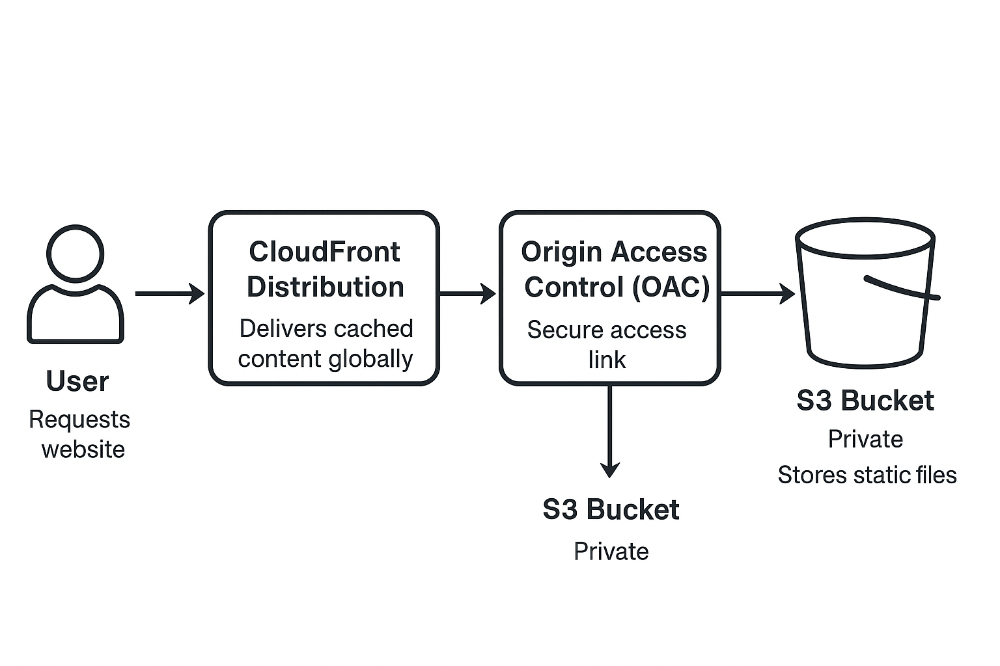

# Deploying a Static Website Using Amazon S3 and CloudFront

Host a static website on AWS using S3 and deliver it globally via CloudFront. This guide covers static site concepts, AWS services used, deployment steps, and architecture.

## What Is a Static Website?

A static website serves fixed files (HTML, CSS, JS, JSON) directly to the browser without backend code or a database.

### Examples
- Personal portfolios  
- Company info pages  
- Documentation sites

## Why Use S3 + CloudFront?

- No servers to manage  
- Cost effective  
- Secure with Origin Access Control (OAC)  
- Fast global delivery via CloudFront edge caching

## Static vs Dynamic Websites

| Static Website      | Dynamic Website          |
|-------------------|------------------------|
| Fixed content      | Content changes dynamically |
| No server-side code | Uses backend languages |
| Fast and cheap     | Slower and more expensive |

## AWS Services

### Amazon S3
- Stores and retrieves files over the internet  
- Globally unique bucket names  
- Pay-as-you-go  
- Secure using Block Public Access, ACLs/IAM, and bucket policies

### Amazon CloudFront
- Caches content at edge locations  
- Works with S3 using OAC  
- Fast, reliable, pay-as-you-go

## Deployment Steps

Full deployment instructions:  
See full deployment instructions [here](docs/deployment-steps.md)

## Project Structure
```
s3-cloudfront-static-website/
│
├── docs/
│ ├── deployment-steps.md
│ └── screenshots/
│ 	├── architecture.png
│ 	├── privately_hosted.png
│ 	└── publicly_hosted.png
├── README.md
├── index.html
└── LICENSE
```

## Architecture Diagram
Below is the architecture of the static website hosted on S3 and delivered through CloudFront:




Private buckets use OAC for secure access; public buckets can be accessed directly.

## Screenshots

**Privately Hosted (OAC Enabled)**  


**Publicly Hosted (No OAC)**  


## License

MIT License. See `LICENSE` file for details.

---