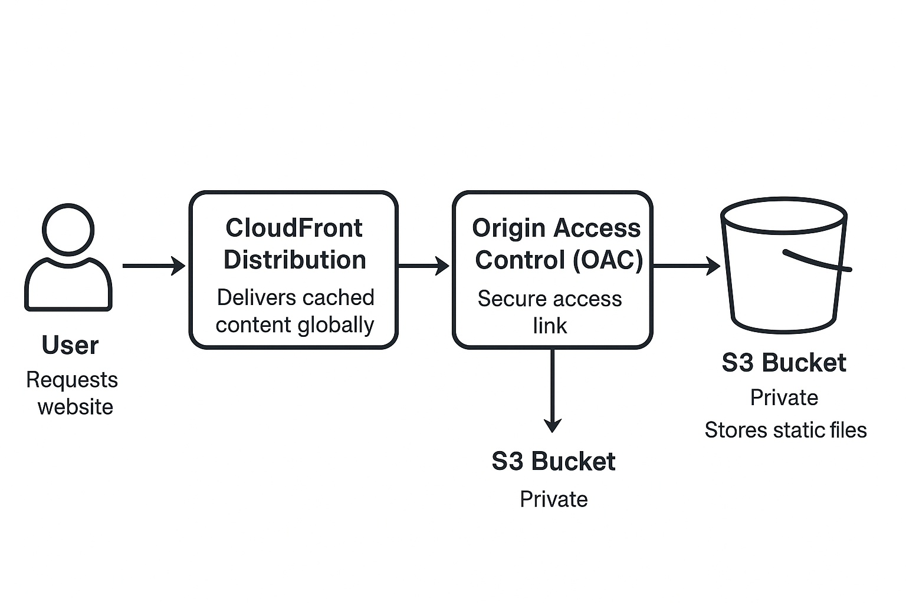
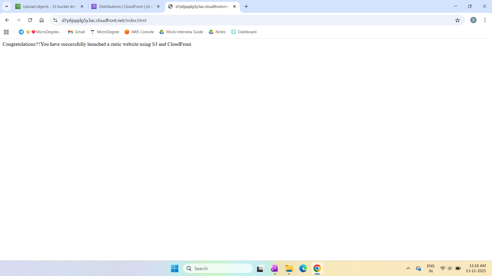

# Static Website Hosting with Amazon S3 and CloudFront

This project demonstrates how to host a static website on AWS S3 and deliver it globally via CloudFront, with both private and public access setups.

---
## What Is a Static Website?

A static website serves fixed files (HTML, CSS, JS, JSON) directly to the browser without backend code or a database.

### Examples
- Personal portfolios  
- Company info pages  
- Documentation sites
---
## Why Use S3 + CloudFront?

- No servers to manage  
- Cost effective  
- Secure with Origin Access Control (OAC)  
- Fast global delivery via CloudFront edge caching
---
## Static vs Dynamic Websites

| Static Website      | Dynamic Website          |
|-------------------|------------------------|
| Fixed content      | Content changes dynamically |
| No server-side code | Uses backend languages |
| Fast and cheap     | Slower and more expensive |

---
## AWS Services

### Amazon S3
- Stores and retrieves files over the internet  
- Globally unique bucket names  
- Pay-as-you-go  
- Secure using Block Public Access, ACLs/IAM, and bucket policies

### Amazon CloudFront
- Caches content at edge locations  
- Works with S3 using OAC  
- Fast, reliable, pay-as-you-go
---
## Prerequisites
- AWS account with appropriate IAM permissions
- A static website (HTML, CSS, JS files)
- Basic knowledge of AWS S3 and CloudFront
---
## Deployment Steps

See full deployment instructions [here](docs/deployment-steps.md)

---
## Project Structure
```
s3-cloudfront-static-website/
│
├── docs/
│   ├── deployment-steps.md
│   └── screenshots/
│       ├── architecture.png
│       ├── privately_hosted.png
│       └── publicly_hosted.png
├── index.html
├── README.md
└── LICENSE
```
---
## Architecture Diagram


> Private buckets use OAC for secure access; public buckets can be accessed directly.

---
## Screenshots

**Privately Hosted (OAC Enabled)**  


**Publicly Hosted (No OAC)**  


---
## About This Project
Built to demonstrate two approaches to static website hosting on AWS — public S3 bucket access and private access secured via CloudFront with Origin Access Control (OAC). Covers the full setup from bucket creation to global content delivery.

---
## Limitations
- S3 static hosting does not support server-side code or databases
- CloudFront cache invalidation may take time to propagate
- Public bucket setup is not recommended for production
- Custom domain and HTTPS require additional Route 53 and ACM configuration
- Intended for learning and demonstration purposes only
---
## License

MIT License. See `LICENSE` file for details.

---
